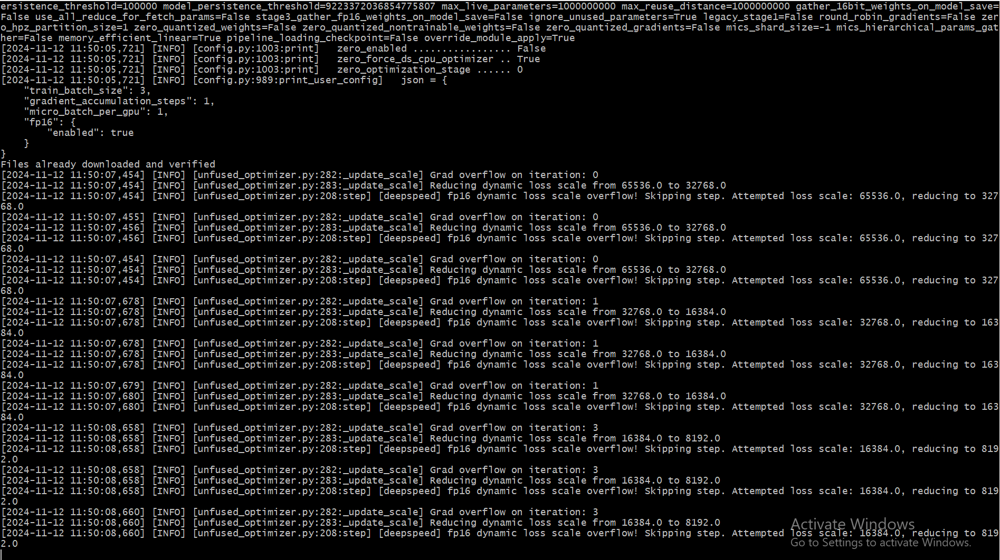

## ECE Tesla Machine Distributed Training (Inter-Node)

This directory includes code of distributed training on Tesla machine (inter-node).


SETUP PASSWORLESS SSH
=====================

Set up passwordless SSH on 5 Tesla machines (ecetesla[0-4]). Default machines use `/bin/tsch` SHELL. First, change `WATID` to your watid and `NEWSHELL` to zsh. Then run

```sh
bash setup/change_cn_shell.sh
```

The script will also check for new updated shell.

Then change also `WATID` in `test_cn_connection.sh`, run the script, and make sure all 5 Tesla machines can retrieve the GPU information

```sh
bash setup/test_cn_connection.sh
```

You can also check their hostname, for example by this command

```sh
ssh ecetesla0 hostname
```

TEST MPI
========

Put these hostnames into `setup/hosts.txt` and compile the first MPI simple hello world program on these 5 machines by

```sh
mpicc -o setup/hello_mpi setup/hello_mpi
```

Finally, we test OpenMPI by running

```sh
mpirun -np 5 --hostfile setup/hosts.txt .setup/hello_mpi
```

INSTALL ENVIRONMENT
===================

(Optional) Configure the .zshrc for more effective

We may use pip virtual environment and install `deepspeed`, `torch` (support CUDA 12.2 although nvidia-smi show CUDA Driver 12.4, otherwise error of pytorch is not compatible with RTX 3070's CUDA capability sm_86). In addition, from [torch document](https://pytorch.org/get-started/locally/), we need to install pytorch supporting CUDA 12.1. Instruction to install can be found from [this](https://www.deepspeed.ai/getting-started/#multi-node-environment-variables).  

```sh
DS_BUILD_OPS=1 DS_BUILD_AIO=0 DS_BUILD_KERNELS=1 DS_BUILD_MPU=1 DS_BUILD_MII=0 pip install deepspeed
``` 

But from our experiment, `pip install deepspeed` should work since DeepSpeed will automatically look for MPI support, we just need to install `mpi4py`.

Native Nebula python (/usr/bin/python) (version 3.8.10) does not support python3-venv, we need to install non-pip virtual environment first, and manually install pip later

```sh
/usr/bin/python3.8 -m venv --without-pip vit_env
source vit_env/bin/activate
```

and install pip through

```sh
curl https://bootstrap.pypa.io/get-pip.py -o get-pip.py
python get-pip.py
python -m pip install --upgrade pip
```

Verify pip version

```sh
pip --version
```

Then install necessary packages

```sh
python -m pip install -r requirement.txt
```

Make sure python is from your new virtual environment.

```sh
which python
# /home/[YOUR_WATID]/vit_env/bin/python
```

Verify torch is working with all machines by addding `python3 /home/$WATID/Scalable_ViT_DT/tesla/script/test_torch_gpu.py` into entry script `entry_cn.sh`. This script will be run distributed using this command

```sh
mpirun -np 5 --hostfile setup/hosts.txt ./entry_cn.sh [YOUR_WATID]
```

USING DEEPSPEED
===============

Create a `.deepspeed_env` file with the necessary environment variables. This file allows DeepSpeed to automatically propagate environment variables to each node.

```sh
echo "NCCL_IB_DISABLE=1" > ~/.deepspeed_env
echo "NCCL_SOCKET_IFNAME=^docker,lo" >> ~/.deepspeed_env
```

Then run Deepspeed test with (enable `#TEST Deepspeed` option in ./entry_cn.sh)

```sh
mpirun -np 5 --hostfile setup/hosts.txt ./entry_cn.sh h3trinh > deepspeed/run_test_deepspeed.log
```

(THE CODE DID NOT WORK YET) Encounter this error, it seems we should not enable fp16 in DeepSpeed

```json
      "_comment": "fp16 is not supported in Tesla0 and Tesla3 ValueError: Type fp16 is not supported", 
      "fp16": {
        "enabled": false
      }
```

We first run homogenous case with 3 GPUs (tesla1,2,4) of RTX 3070 - 8GB using this deepspeed_config.json file
```json
{
    "train_batch_size": 3,
    "gradient_accumulation_steps": 1,
    "micro_batch_per_gpu": 1,
    "fp16": {
      "enabled": true,
      "initial_scale_power": 10
    }
  }
```

The `train_batch_size` should be equal to `gradient_accumulation_steps` * `micro_batch_per_gpu` * number of MPI processes running.

Please note the GPU's memory is GPU is 8GB, using large `args.batch_size` would result in this error

```sh
RuntimeError: CUDA error: CUBLAS_STATUS_ALLOC_FAILED when calling `cublasCreate(handle)
``` 

Default enable of FP16, its dynamic loss scaling will encounter numerical instability for all every iterations. 



This happens because the loss scale is too high, resulting in values that exceed the representable range in FP16. We reduce the initial loss scale to avoid the dynamic scaler from starting too high by setting `"initial_scale_power": 10` and lower it if needed.
 

 This configuration (for 3GPUs)

 ```json
"train_batch_size": 192,
"gradient_accumulation_steps": 1,
"micro_batch_per_gpu": 64,
 ```
 
 will result in OOM error

 ```sh
 [rank2]: torch.OutOfMemoryError: CUDA out of memory. Tried to allocate 56.00 MiB. GPU 0 has a total capacity of 7.79 GiB of which 20.75 MiB is free. Process 3441597 has 2.54 GiB memory in use. Process 2618016 has 274.00 MiB memory in use. Process 2618019 has 274.00 MiB memory in use. Process 2618020 has 274.00 MiB memory in use. Including non-PyTorch memory, this process has 4.41 GiB memory in use. Of the allocated memory 3.90 GiB is allocated by PyTorch, and 220.70 MiB is reserved by PyTorch but unallocated. If reserved but unallocated memory is large try setting PYTORCH_CUDA_ALLOC_CONF=expandable_segments:True to avoid fragmentation.  See documentation for Memory Management  (https://pytorch.org/docs/stable/notes/cuda.html#environment-variables)


TODO
====

### Deepspeed

- [x] Initialize deepspeed and test it with dummy distributed matrix multiplcation on 5 machines (deepspeed/test_deepspeed_2.py)

- [x] Update the test to record GPU performance (using GPUtil)

- [x] Write Python script to plot/virtualize from this log

- [ ] Adapt the distributed training script

### Torch distributed

- [ ] Create torch distributed and run on 5 different machines to benchmarking the performance (baseline_measure.py)

- [ ] Update the pipeline to record these metrics

- [ ] Write Python script to plot/virtualize from this log

- [ ] Adapt the distributed training script
