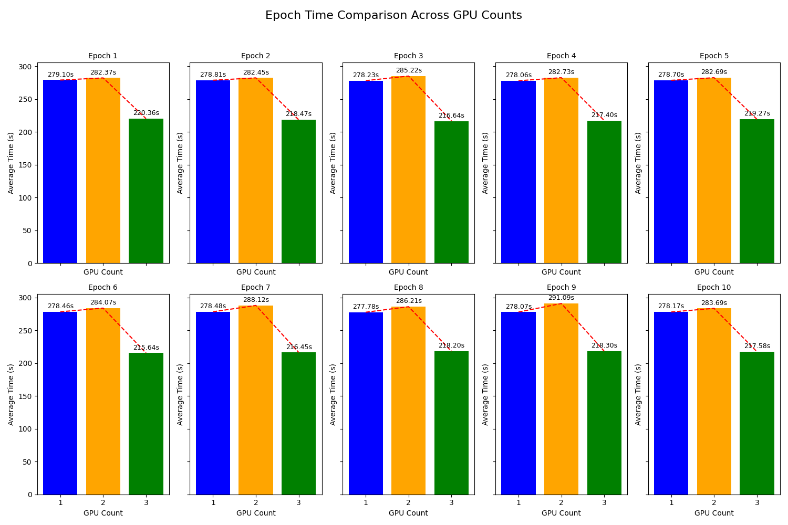
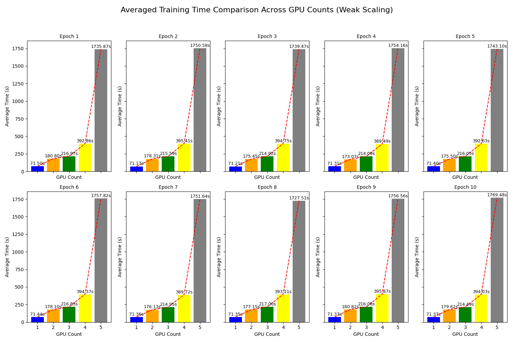
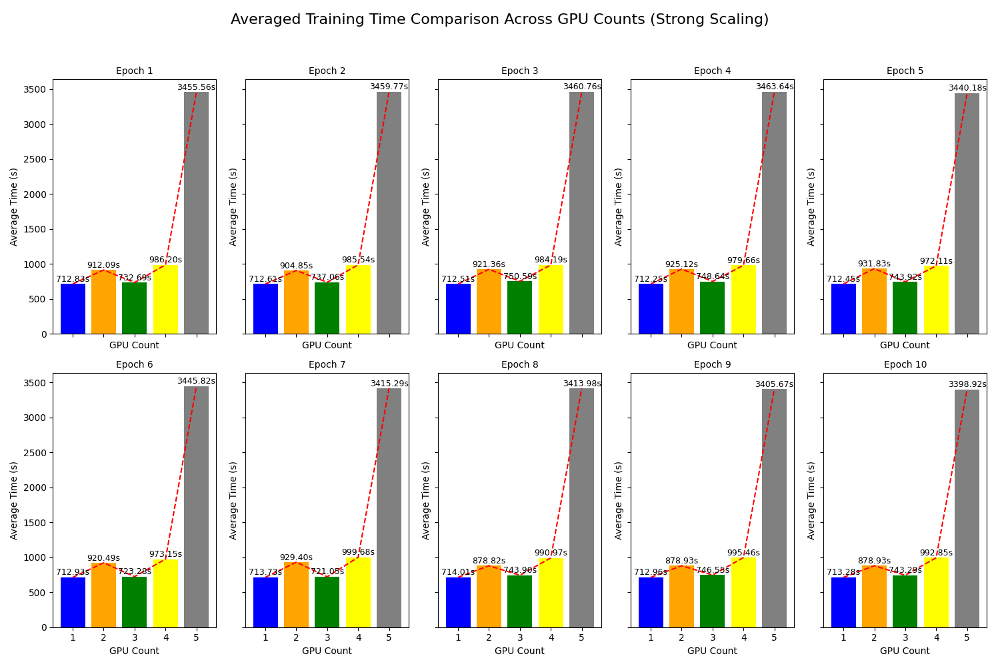

# Result Accumulation

For mixed-precision FP16 training, we tested on 3 RTX3070 GPUs only. We increased to `micro_batch_per_gpu` to 32 which is maximum supported on 3 GPUs.

For full floating point training, We used `micro_batch_per_gpu` to 16 which is maximum supported on 5 GPUs. We also used the whole dataset CIFAR-10 for strong scaling, while for weak scaling, we increased from 10% to 50% propotionally to 1-5 GPUS. 

### Weak Scaling

### Strong Scaling

